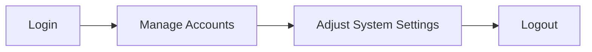

The administrative section covers day-to-day management of your NetGain deployment.
Here you will find guidance for managing user accounts, tuning system settings and using built-in maintenance tools.

Key areas include:

- **Admin Module** – configure accounts, jobs, Elasticsearch and logs.
- **Sys Admin & Tools** – perform backups and other server maintenance tasks.

Typical admin workflow

