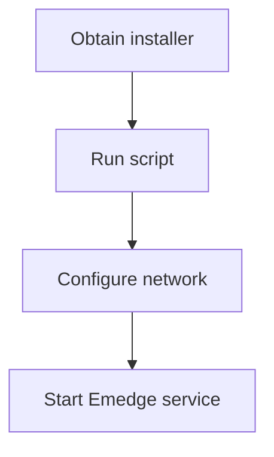

This section guides you through installing **NetGain Emedge** and related modules on your servers.
We cover prerequisites, environment setup and post-installation checks so you can start monitoring quickly.

### Quick Start Example

```bash
# 1. Download the installer
curl -O https://example.com/netgain/emedge-installer.sh

# 2. Run the installer with root privileges
sudo bash emedge-installer.sh
```

<details>
<summary>Installation workflow diagram</summary>



</details>
