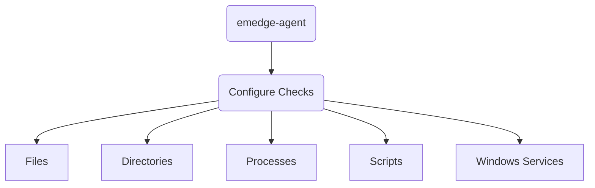

Use configuration checks to verify that important files, directories and
processes remain in their expected state on each monitored host.

## How to configure checks
1. Open **emedge-agent** from the installation menu.
2. Select **Configure Checks**.
3. Choose the type of check and provide the required details.
4. Save the configuration to start monitoring.

*  <a href="/installation/emedge/emedge-agent/config_checks/files">Files</a>
*  <a href="/installation/emedge/emedge-agent/config_checks/directories">Directories</a>
*  <a href="/installation/emedge/emedge-agent/config_checks/processes">Processes</a>
*  <a href="/installation/emedge/emedge-agent/config_checks/scripts">Scripts</a>
*  <a href="/installation/emedge/emedge-agent/config_checks/winsvc">Windows Services</a>
