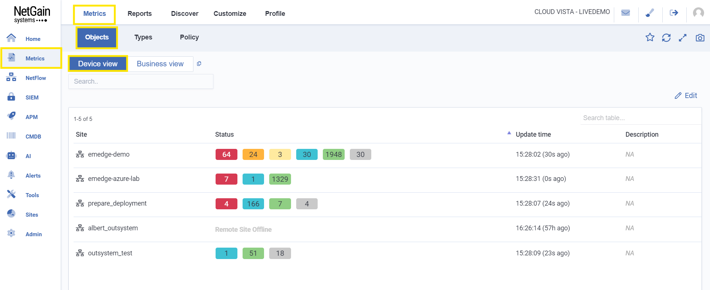
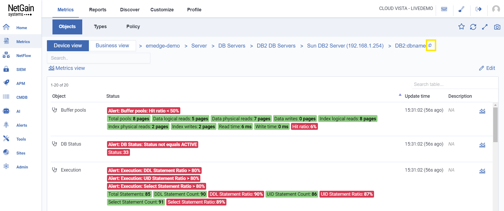
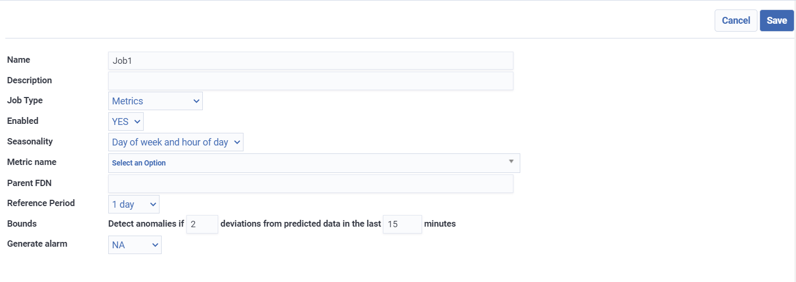
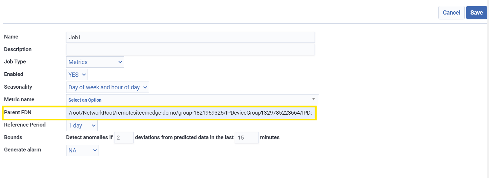
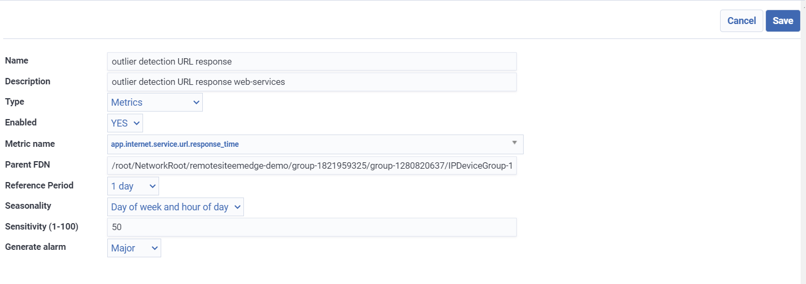
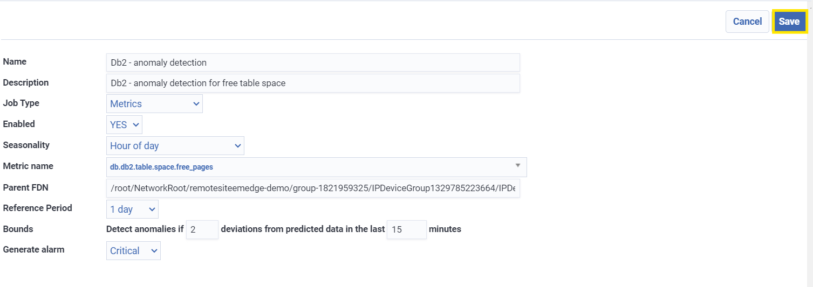
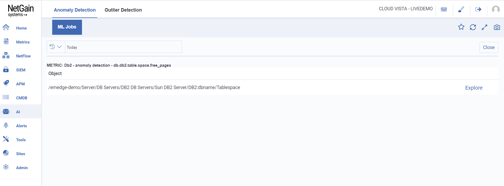
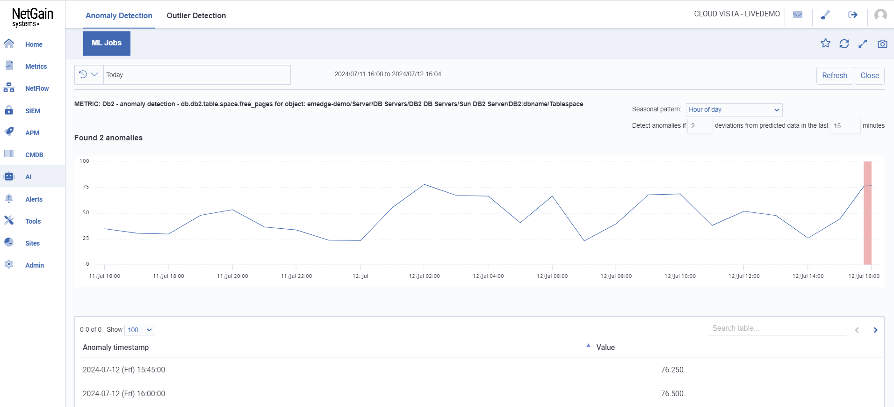
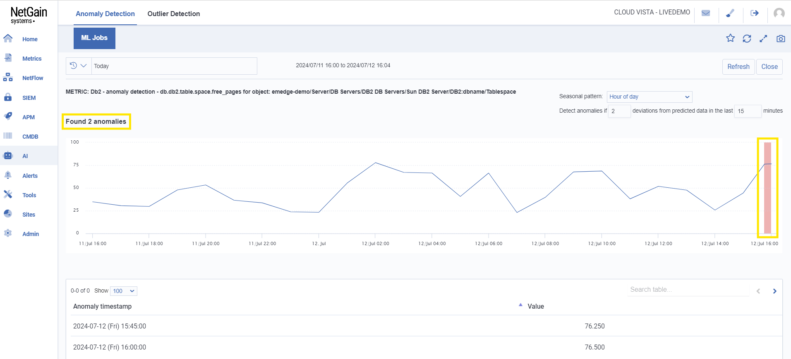
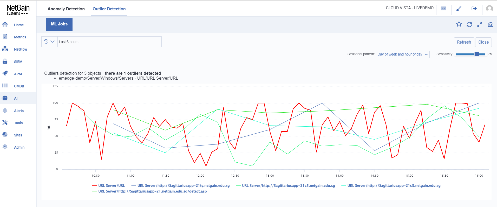

# AIOps (Data Forecasting) with NetGain

NetGain Cloud Vista uses advanced machine learning algorithms to provide data forecasting, anomaly detection, and outlier detection for monitoring metrics. The system relies on historical data as training input, where users can specify the time duration for training (e.g., past weeks or months of data). In addition, the model considers seasonal patterns such as the hour of the day, day of the week, and month of the year, which helps improve the accuracy by accounting for periodic trends.
 
NetGain leverages a variety of machine learning algorithms:
 
- RandomForest: For predictive analysis, this ensemble method creates multiple decision trees and averages the results to forecast trends, reducing overfitting and enhancing generalization.
- IsolationForest: This unsupervised algorithm is used for anomaly and outlier detection by isolating unusual data points based on their characteristics.
- Logistic Regression: Used for classifying data, particularly for binary predictions (e.g., whether certain events will occur or not based on previous patterns).
 
Each algorithm is fine-tuned to process large volumes of monitoring data and provide accurate, actionable insights. The forecasting also offers user-controlled sensitivity levels, allowing customization of the model’s sensitivity to changes or anomalies, based on specific operational needs.
 
## Forecast Accuracy
 
The accuracy of forecasts depends on the quality and volume of historical data provided, as well as the complexity of the monitored environment. Based on internal testing, NetGain Cloud Vista typically achieves forecast accuracy between 85% to 95%, depending on the data set and patterns involved. This range can be optimized further by adjusting the sensitivity level and including adequate seasonality information, ensuring that predictions are reliable for both normal trends and anomaly detection.

# Intelligent Anomaly Detection

NetGain’s Anomaly Detection capabilities are designed to pinpoint patterns and data points that deviate from expected norms within your datasets. By applying machine learning models tailored to your unique environment, we can detect subtle anomalies that might otherwise go unnoticed, providing you with actionable insights to address potential issues early.

# Precise Outlier Detection

With NetGain’s Outlier Detection, we go beyond traditional monitoring to identify data points that are significantly different from the rest of the dataset. These outliers, which could indicate potential threats or irregularities, are flagged by our system, allowing you to take swift action to mitigate risks and ensure optimal performance across your network.

# Same steps apply for both Anomaly and Outlier Detection.

---

Basic information includes:
* Job Name
* Description
* Type
* Details

# Add Job

Click on \<Metrics>,\<Metrics>\<Objects> then \<Device View>.

---

Select the sites and the Object that you want to create ML (Machine Learning) Jobs.

---

Copy the path.

---

Click on  to add Job.

---

Once clicked, a panel will appear to add Job.

---

Paste the copied path into the Parent FDN.

---

Input the remaining information (For Anomaly Detection).

Information includes:
* Name: name for your job
* Description: description of the job 
* Job Type: type of job (Select Metrics, other types are seldom used)
* Enabled: a toggle to enable or disable the job
* Seasonality: to account for regular, predictable patterns in the data
* Metrics name: the metric to be monitored
* Parent FDN: path of the job
* Reference Period: the time period over which data should be used to generate a baseline for anomaly detection
* Bounds: set criteria to trigger alerts 
* Generate alarm: define the criteria of alarm

---

(For Outlier Detection)

Information includes:
* Name: name of your job
* Description: description of the job 
* Job Type: type of job (Select Metrics, other types are seldom used)
* Enabled: a toggle to enable or disable the job 
* Seasonality: to account for regular predictable patterns in the data
* Metrics name: the metric to be monitored
* Parent FDN: path of the Job
* Reference Period: the time period over which data should be used to generate a baseline for anomaly detection
* Sensitivity (1-100): determines how easily the system identifies data points as outliers
* Generate alarm: define the criteria for alarm

---

Click on  to create the job.

---

Successful creation of Job.

---

# Edit Job

Hover over the job and click on  to edit the information of the Job.

---

# Delete Job

Hover over the job and click on  to delete the job.

---

# View Details of Job

Click on the Job Name.

---

Once clicked, the page will navigate to the dedicated page of the selected Job.

---

Click on the  to further view details of the Job.

---

Once clicked, the page will navigate to the dedicated page for further viewing of details of the Job (For Anomaly Detection).

---

Once anomalies are detected in the graph, it will trigger the alarms.

---

Click on \<Alerts>,\<Alerts> then \<Current> and select Anomaly Alarms to view the triggered alarms.

---

(For Outlier Detection)

---

Adjust the sensitivity to control how easily the system identifies data points as outliers.

