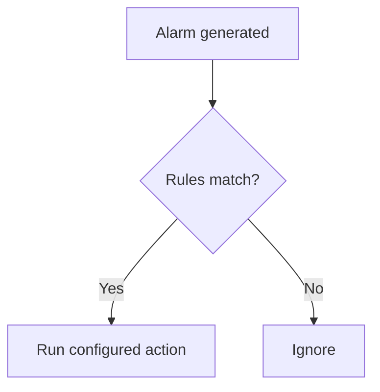

Action Triggers allow the system to automatically run commands whenever a matching alarm is raised. They are useful for self-healing scripts, creating tickets or logging additional data.

To create a trigger:

1. Go to <Alerts> -> <Action Triggers> and click **Create**.
2. Provide a name and description for the trigger.
3. Define the conditions that an alarm must match (such as object, severity or policy).
4. Enter the command or script that should run when the trigger fires.
5. Save the trigger and verify it with a test alarm.

Alarm to Action Workflow

*Note: The example assumes a default installation. Adjust script paths and permissions based on your environment.*
