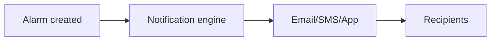

Alert Notifications deliver alarms to users via e‑mail, SMS, chat applications or on‑screen prompts. Configure the notification methods so that the right people are informed when issues occur.

Steps for setting up notifications:

1. Navigate to <Alerts> -> <Notifications>.
2. Choose the channel you want to configure (Email, SMS, Line, etc.).
3. Enter recipient details and any authentication required for that channel.
4. Map notification rules to alert categories so messages are sent at the right time.
5. Save the configuration and test by sending a sample notification.

Alarm delivery flow

*Note: Credentials, server addresses and message formats should be adapted to match your organization's environment.*
