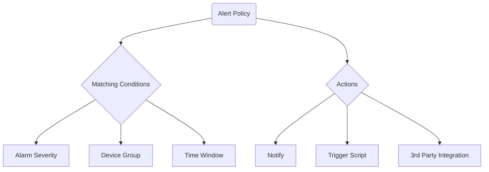

Alert policies determine how alerts are triggered and handled for your devices.
Use them to tailor notification rules and automated actions according to
business needs.

## Creating an alert policy
1. Navigate to **Alerts > Alert Policies**.
2. Click **Create Policy** and provide a name.
3. Select the devices or groups to which this policy applies.
4. Define the trigger conditions such as severity or time window.
5. Choose the actions (e-mail, webhook, script) that should run when the
   conditions are met.
6. Click **Save** to activate the policy.

