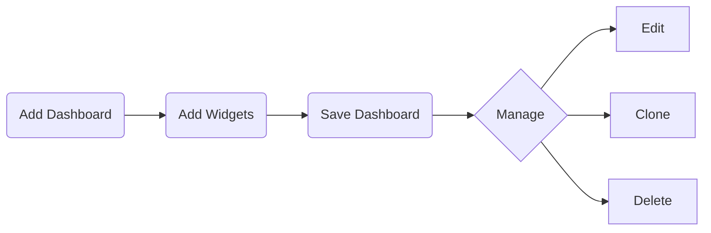

You can add a new dashboard and customize it to display the information that
matters most to you.

## Steps
1. From the dashboard page click **Add Dashboard** on the top menu.
2. Enter a **Name** and optional **Group** for the dashboard.
3. Click **Create** to open the empty dashboard.
4. Proceed to [add widgets](/modules/home/dashboards/addwidget) to populate the
   dashboard.

