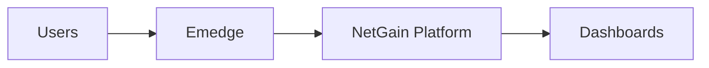

Welcome to the overview section of the **NetGain Systems** documentation. Here you can explore high-level concepts and learn how the platform pieces fit together.

Key topics:

- [Architecture](./architecture) – see how Emedge collects data and sends it to the platform.
- [Solution Modules](/modules/) – dive into monitoring, analytics and more.

Platform at a glance

