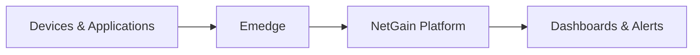

{} is your all-in-one observability platform—built to turn raw IT data into actionable insights. From seamless data normalization and processing to dynamic dashboards and reporting, it does the heavy lifting so you can focus on decisions. With easy integration into ticketing, collaboration, and messaging tools, NetGain keeps your team informed and ahead of every issue.

Emedge is the heart of our solution, strategically deployed within your enterprise network—whether on-premises, in the public or private cloud, or across a hybrid infrastructure. This lightweight yet powerful software works behind the scenes, collecting critical IT infrastructure data. From device metrics to logs and traces, Emedge captures it all, regardless of where your infrastructure resides.

With data transmission secured by encryption, Emedge ensures your information is safely delivered to {}, where the magic of analysis and visualization happens. Leveraging open protocols, Emedge seamlessly gathers data from SNMP, JDBC, Elastic Beats and more. This flexibility ensures that no part of your infrastructure is left in the dark.

Together, {} and Emedge provide full visibility into your IT ecosystem, whether on-premises, in the cloud, or within a hybrid environment.

Data flow overview

