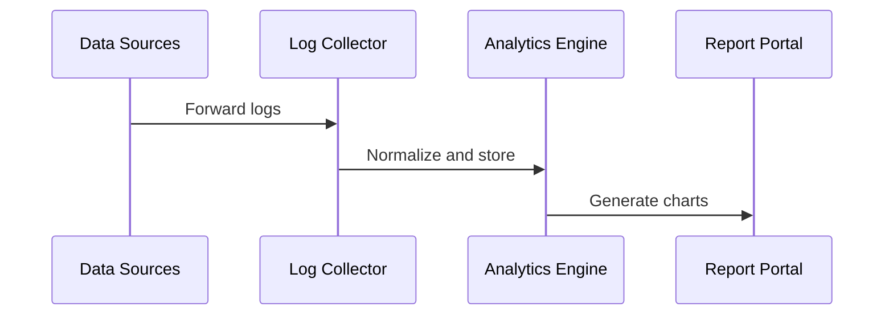

Security reports provide actionable insight into potential threats, system vulnerabilities and compliance status. NetGain consolidates log data and metrics to generate dashboards that help you monitor your environment.

### Customizing a report

1. Open **Reports** from the sidebar.
2. Choose the log source or device group you wish to analyze.
3. Pick a template such as *Login Events* and adjust the time range.
4. Click **Generate** to view charts and export to PDF.

Typical reporting flow:

Show reporting flow diagram

