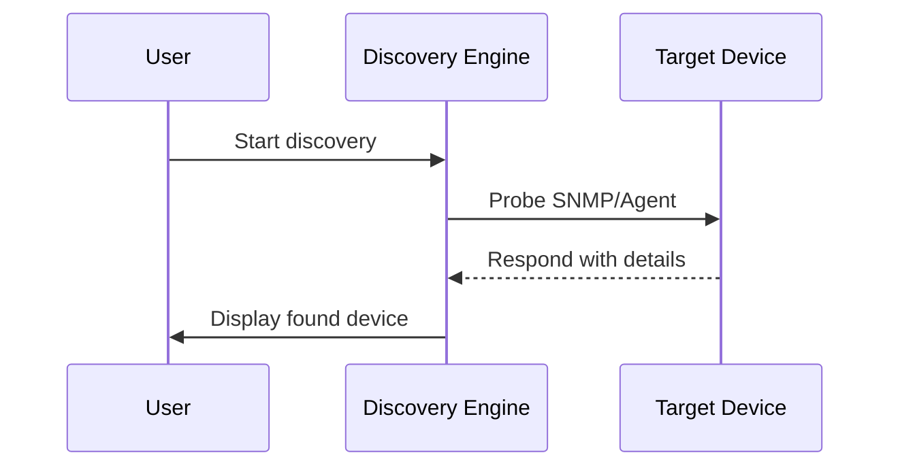

## Overview

Typical issues during monitoring and discovery include unreachable devices, incorrect or outdated SNMP/Agent credentials, and blocked network ports. These problems prevent the NetGain server from collecting data or identifying devices on the network.

## Steps to resolve

1. Verify that the device responds to `ping` from the NetGain server.
2. Confirm SNMP or agent services are running and accessible.
3. Double‑check community strings or authentication details.
4. Ensure firewalls allow required ports such as UDP 161 for SNMP.
5. Rerun the discovery wizard and review logs for errors.
6. Use `snmpwalk` or similar tools to verify a device responds correctly.

Show discovery flow diagram

