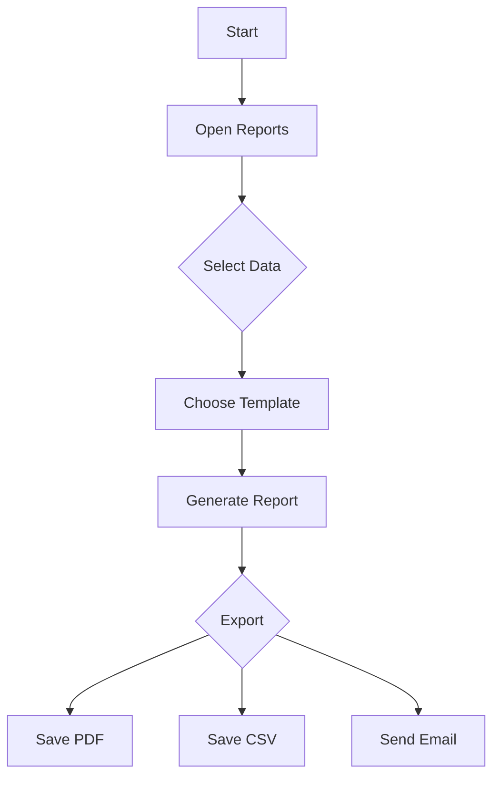

Common questions about generating and managing reports.

### How do I create a new report?
1. Navigate to **Reports** > **Create**.
2. Select the data source and template.
3. Click **Generate**.

### Can I schedule reports?
Yes. Enable the **Schedule** option when creating a report and specify the desired frequency. The system will generate and deliver the report automatically.

### Where are reports saved?
Generated reports appear under **Reports** > **History** where you can download or review them at any time.

### What export formats are available?
Reports can be exported as **PDF**, **CSV**, or sent via email.

Report generation flow

=======
