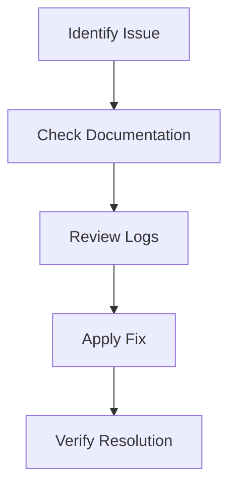

This section collects frequently asked questions and common issues encountered while deploying or managing the **NetGain** platform. Select a topic from the list to view step-by-step solutions.

Click for an overview diagram

